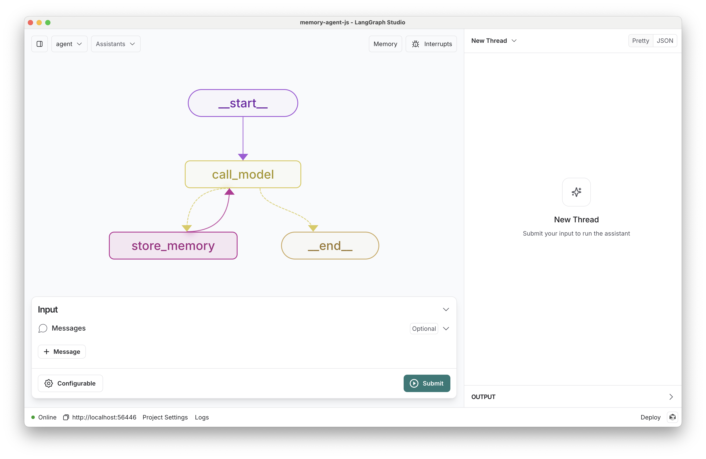

# LangGraph Concierge - A Memory-Enhanced Conversational Agent

[](https://github.com/langchain-ai/memory-agent-js/actions/workflows/unit-tests.yml)
[](https://github.com/langchain-ai/memory-agent-js/actions/workflows/integration-tests.yml)
[![Open in - LangGraph Studio](https://img.shields.io/badge/Open_in-LangGraph_Studio-00324d.svg?logo=data:image/svg%2bxml;base64,PHN2ZyB4bWxucz0iaHR0cDovL3d3dy53My5vcmcvMjAwMC9zdmciIHdpZHRoPSI4NS4zMzMiIGhlaWdodD0iODUuMzMzIiB2ZXJzaW9uPSIxLjAiIHZpZXdCb3g9IjAgMCA2NCA2NCI+PHBhdGggZD0iTTEzIDcuOGMtNi4zIDMuMS03LjEgNi4zLTYuOCAyNS43LjQgMjQuNi4zIDI0LjUgMjUuOSAyNC41QzU3LjUgNTggNTggNTcuNSA1OCAzMi4zIDU4IDcuMyA1Ni43IDYgMzIgNmMtMTIuOCAwLTE2LjEuMy0xOSAxLjhtMzcuNiAxNi42YzIuOCAyLjggMy40IDQuMiAzLjQgNy42cy0uNiA0LjgtMy40IDcuNkw0Ny4yIDQzSDE2LjhsLTMuNC0zLjRjLTQuOC00LjgtNC44LTEwLjQgMC0xNS4ybDMuNC0zLjRoMzAuNHoiLz48cGF0aCBkPSJNMTguOSAyNS42Yy0xLjEgMS4zLTEgMS43LjQgMi41LjkuNiAxLjcgMS44IDEuNyAyLjcgMCAxIC43IDIuOCAxLjYgNC4xIDEuNCAxLjkgMS40IDIuNS4zIDMuMi0xIC42LS42LjkgMS40LjkgMS41IDAgMi43LS41IDIuNy0xIDAtLjYgMS4xLS44IDIuNi0uNGwyLjYuNy0xLjgtMi45Yy01LjktOS4zLTkuNC0xMi4zLTExLjUtOS44TTM5IDI2YzAgMS4xLS45IDIuNS0yIDMuMi0yLjQgMS41LTIuNiAzLjQtLjUgNC4yLjguMyAyIDEuNyAyLjUgMy4xLjYgMS41IDEuNCAyLjMgMiAyIDEuNS0uOSAxLjItMy41LS40LTMuNS0yLjEgMC0yLjgtMi44LS44LTMuMyAxLjYtLjQgMS42LS41IDAtLjYtMS4xLS4xLTEuNS0uNi0xLjItMS42LjctMS43IDMuMy0yLjEgMy41LS41LjEuNS4yIDEuNi4zIDIuMiAwIC43LjkgMS40IDEuOSAxLjYgMi4xLjQgMi4zLTIuMy4yLTMuMi0uOC0uMy0yLTEuNy0yLjUtMy4xLTEuMS0zLTMtMy4zLTMtLjUiLz48L3N2Zz4=)](https://langgraph-studio.vercel.app/templates/open?githubUrl=https://github.com/langchain-ai/memory-agent-js)

A sophisticated TypeScript implementation of a ReAct-style conversational agent with persistent memory capabilities. Built using LangGraph and LangChain.js, this agent can remember and learn from conversations across multiple sessions, making it ideal for building personalized, context-aware chatbots.



## Features

- 🧠 **Persistent Memory**: Stores and retrieves important information across conversation sessions
- 👤 **User-Scoped Memory**: Memories are scoped to individual users for personalized interactions
- 🔄 **ReAct Architecture**: Implements the Reasoning and Acting (ReAct) paradigm for more intelligent responses
- 🎯 **Extensible Design**: Easy to add new tools and customize memory structure
- 📊 **Built-in Evaluation**: Includes test suite for memory quality assessment

## Prerequisites

- Node.js (v16 or higher)
- npm or yarn
- LangGraph Studio (for deployment)

## Quick Start

1. **Clone the Repository**

   ```bash
   git clone https://github.com/yourusername/langgraph-concierge.git
   cd langgraph-concierge
   ```

2. **Install Dependencies**

   ```bash
   npm install
   # or
   yarn install
   ```

3. **Configure Environment**

   ```bash
   cp .env.example .env
   ```

4. **Set Up API Keys**

   **OpenAI (Alternative)**

   ```env
   OPENAI_API_KEY=your-api-key
   ```

5. **Run the Application**
   ```bash
   npm start
   # or
   yarn start
   ```

## Usage

### Local Development

1. Start the development server:

   ```bash
   npm run dev
   ```

2. Open LangGraph Studio and navigate to the `memory_agent` graph

3. Start a conversation with the agent. Try sharing personal information or preferences

4. Create a new conversation thread using the '+' icon to test memory persistence

### Memory Management

- View saved memories using the "memory" button in the UI
- Memories are automatically saved when the agent identifies important information
- Each memory includes both content and context for better retrieval

## Configuration

### Model Selection

The default model is `anthropic/claude-3-5-sonnet-20240620`. You can change it in your configuration:

```yaml
model: anthropic/claude-3-5-sonnet-20240620  # default
# or
model: openai/gpt-4  # alternative
```

### Customization Options

1. **Memory Structure**: Modify the memory schema in `src/types/memory.ts`
2. **Agent Tools**: Add new tools in `src/tools/`
3. **Prompts**: Customize agent behavior in `src/memory_agent/prompts.ts`

## Testing

Run the test suite to evaluate memory quality:

```bash
npm test
# or
yarn test
```

The test suite includes:

- Unit tests for core functionality
- Integration tests for memory persistence
- Evaluation cases for memory quality

## Architecture

The project uses a directed acyclic graph (DAG) architecture with the following key components:

1. **Memory Store**: Persistent storage for user-specific memories
2. **ReAct Agent**: Processes user input and decides when to store/retrieve memories
3. **Tool Router**: Manages the execution of various agent tools
4. **Memory Manager**: Handles memory storage and retrieval operations

## Contributing

1. Fork the repository
2. Create a feature branch
3. Commit your changes
4. Push to the branch
5. Create a Pull Request

## License

This project is licensed under the MIT License - see the [LICENSE](LICENSE) file for details.

## Acknowledgments

- Built with [LangGraph](https://github.com/langchain-ai/langgraph)
- Powered by [LangChain.js](https://js.langchain.com/)
